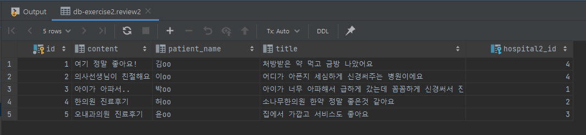

# JPA Data Mapping 실습 프로젝트

### 1️⃣ Book Management

#### Data

**book2**

 

**author2**

 

**publisher2**

 

 

#### EndPoint

|        기능         |   API Mapping    |                             EC2                              |
| :-----------------: | :--------------: | :----------------------------------------------------------: |
| 도서 전체 목록 조회 | GET api/v1/books | http://ec2-3-35-227-194.ap-northeast-2.compute.amazonaws.com:8080/api/v1/books |
|                     |                  |                                                              |
|                     |                  |                                                              |
|                     |                  |                                                              |

 

 

---

### 2️⃣ Hospital Board

#### Data

**hospital2**

 

**review2**

 

 

#### EndPoint

|            기능            |        API Mapping        |                             EC2                              |
| :------------------------: | :-----------------------: | :----------------------------------------------------------: |
| 병원 상세정보 및 댓글 조회 | GET api/v1/hospitals/{id} | http://ec2-3-35-227-194.ap-northeast-2.compute.amazonaws.com:8080/api/v1/hospitals/4 |
|                            |                           |                                                              |
|                            |                           |                                                              |
|                            |                           |                                                              |

