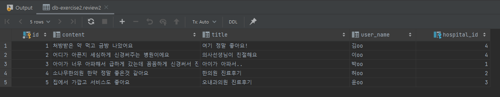
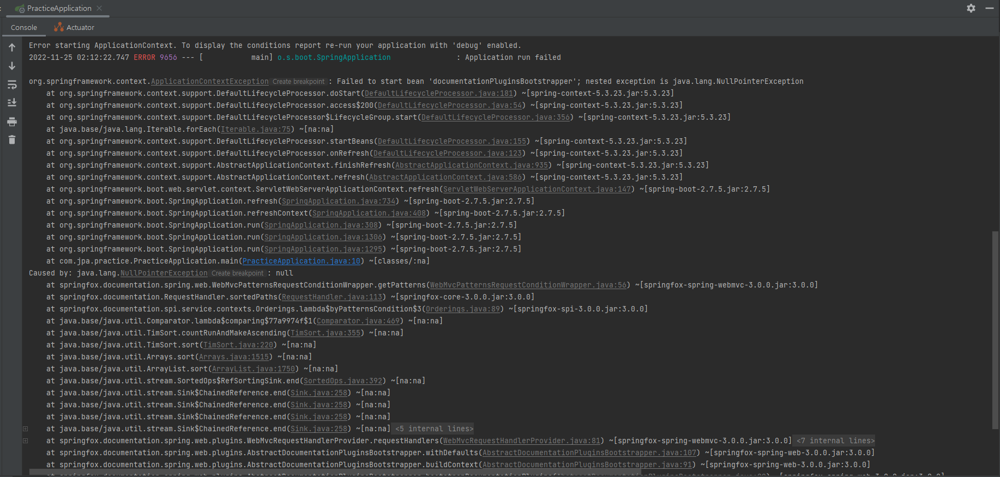
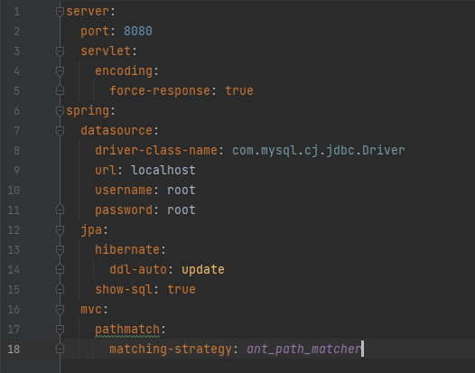

# JPA Data Mapping 실습 프로젝트

### 1️⃣ Book Management

#### Data

**book2**


**author2**


**publisher2**


<br />

#### EndPoint

|        기능         |   API Mapping    |                              Ex                              |
| :-----------------: | :--------------: | :----------------------------------------------------------: |
| 도서 전체 목록 조회 | GET api/v1/books | http://ec2-3-35-227-194.ap-northeast-2.compute.amazonaws.com:8080/api/v1/books |

<br />

<br />

---

### 2️⃣ Hospital Board

#### Data

**hospital2**


**review2**



<br />

#### EndPoint

|          기능           |            API Mapping             |                              Ex                              |
| :---------------------: | :--------------------------------: | :----------------------------------------------------------: |
|  병원 전체 리스트 조회  |        GET api/v1/hospitals        | http://ec2-3-35-227-194.ap-northeast-2.compute.amazonaws.com:8080/api/v1/hospitals |
| 특정 병원 상세정보 조회 |     GET api/v1/hospitals/{id}      | http://ec2-3-35-227-194.ap-northeast-2.compute.amazonaws.com:8080/api/v1/hospitals/4 |
|        댓글 등록        | POST api/v1/hospitals/{id}/reviews | http://ec2-3-35-227-194.ap-northeast-2.compute.amazonaws.com:8080/api/v1/hospitals/4/reviews |
|  댓글 전체 리스트 조회  | GET api/v1/hospitals/{id}/reviews  | http://ec2-3-35-227-194.ap-northeast-2.compute.amazonaws.com:8080/api/v1/hospitals/4/reviews |
| 특정 댓글 상세정보 조회 | GET api/v1/hospitals/reviews/{id}  | http://ec2-3-35-227-194.ap-northeast-2.compute.amazonaws.com:8080/api/v1/hospitals/reviews/2 |

<br />

<br />

## 📒 Swagger EndPoint

http://ec2-3-35-227-194.ap-northeast-2.compute.amazonaws.com:8080/swagger-ui/

<br />

### ⚠ Swagger-ui 적용 시 발생하는 에러 및 해결 방법

#### ❗ 발생한 에러



👉 ```org.springframework.context.ApplicationContextException: Failed to start bean 'documentationPluginsBootstrapper'; nested exception is java.lang.NullPointerException...```

<br />

#### ❓ 발생 원인

👉 Spring boot 2.6 버전 이후 ```spring.mvc.pathmatch.matching-strategy``` 값이 ```ant_path_matcher```에서 ```path_pattern_parser```로 변경되어 발생하는 에러

<br />

#### 💡 해결방법



👉 application.yml에 `spring.mvc.pathmatch.matching-strategy: ant_path_matcher` 설정 해주기
